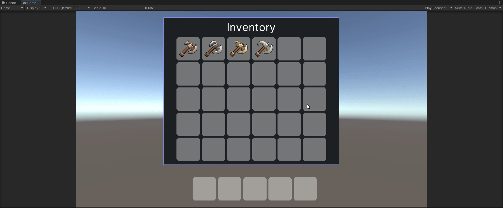
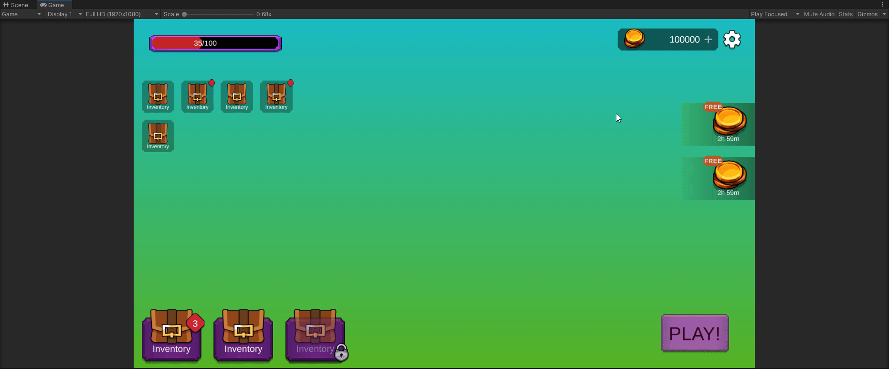

# UIProjects
 Creating Ui Projects for showcase

## Inventory 
Project was Created using Runtime UI Toolkit
The Project is about creating grid based inventory system, there you can manually sort items.
Navbaris shortcut to the given Item in Inventory.
Time - 4 Hours

## Casual Game Panel 
Project was Created using IMGUI (Gamobject based UI system of Unity)
The Project is about showing the use of RectTransform and its component knowledge and overall knowledge of IMGUI system.
In addition, part of panel is made Using [Better UI Asset](https://assetstore.unity.com/packages/tools/gui/better-ui-79031) to show familiarty with other UI Managment Systems.

Time - 2 Hours

